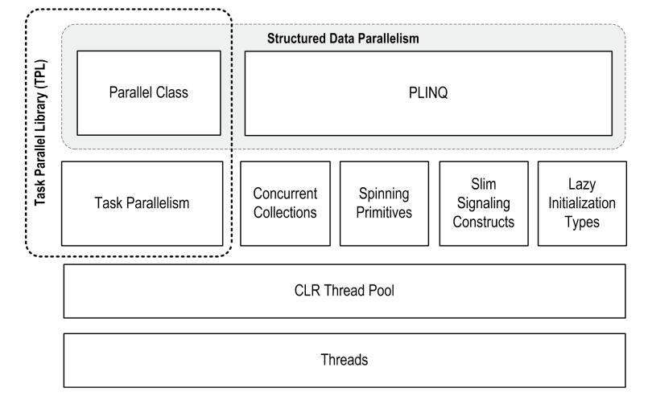
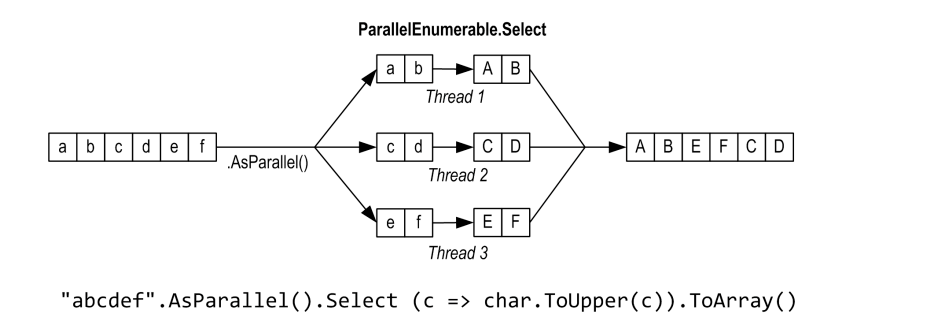

### 前言

在前三章中我们的案例大量使用到了`Thread`这个类，通过其原始API，对其进行创建、启动、中断、中断、终止、取消以及异常处理，这样的写法不仅不够优雅（对接下来这篇，我称其为`.NET现代化并行编程体系`中出现的API而言），并且大部分的接口都是极度复杂和危险的。很幸运，如今.NET已经提供，并且普及了一系列多线程API来帮助我们，优雅且安全的达到相同的目的。

其中，`Parallel`和`Task`被一起称为TPL（Task Parallel Library，任务并行库），而这对双子星也就是我们本章的主题。如果您对线程基础、并行原理不是很了解，我还是强烈建议先学习前面的章节，万丈高楼平地起是前提是地基打的足够结实！

## 一、PFX

Parallel Framework，并行框架：用于并行编程，帮助你充分利用CPU的多个核心。



其中`PLINQ`提供最丰富的功能：它能够自动化并行所有步骤--包括工作分解，多线程执行，并整理结果输出一个序列。它是声明式（declarative）的--你只需构造一个`Linq`，然后由框架来帮你完成剩下的工作。

`Parallel`和`Task`是指令式（imperative）的--你需要自己编写代码来整理结果，甚至分解工作。

|                                                              | Partitions work | Collates results |
| :----------------------------------------------------------- | :-------------- | :--------------- |
| [PLINQ](https://www.albahari.com/threading/part5.aspx#_PLINQ) | Yes             | Yes              |
| The `Parallel` class                                         | Yes             | No               |
| PFX’s [task parallelism](https://www.albahari.com/threading/part5.aspx#_Task_Parallelism) | No              | No               |

瘦信号`Slim Signaling` 和 延迟初始化`Lazy Initialization`我们已经在前面的章节中讲过了，并发集合`Concurrent Collections` 和 自旋基元`Spinning Primitives`事实上我们也模拟过，在本章会进一步来讲。

> 这里可能要解释一下什么是结构化：一切有条不紊、充满合理逻辑和准则的。
>
> 在早期使用汇编编程时，为了更加契合计算机运行的实际状况，控制流分为“顺序执行”和“跳转”，这里的跳转也就是著名的--goto，无条件跳转可能会使得代码运行杂乱无章，不可预测。Dijkstra著名的goto有害论的中翻地址：https://www.emon100.com/goto-translation/

### 阿姆达尔定律

阿姆达尔定律 Amdahl's law，指出了固定负载（必须顺序执行的部分）情况下，处理器并行运算的最大性能提升
$$
假设处理器个数为n，可并行部分为w，则加速比s = 1 / ((1 - w) + w / n)
$$
讨论：

$$
当固定负载(1-w)\to 0，即w\to 1时几乎没有串行部分，加速比s\to n
$$

$$
当可并行部分w\to 0时几乎没有可并行部分，加速比s\to 1，此时无论加多少处理器也没啥效果
$$

$$
当处理器个数n\to \infty时，加速比s\to 1 / (1 - w)，这也是加速比上限
$$

综上：
$$
加速比s取决于可并行部分w或串行部分1-w，即s = 1 / 串行占比
$$

### 使用场景

使用`PFX`前需要检查是否真的有必要并行，经过对阿姆达尔定律的了解，我们可以看出，并非使用更多的处理器，性能就能随之水涨船高。如果顺序执行的代码段占了这个工作的三分之二，即使用无数核心，也无法获得哪怕0.5倍的性能提升。

在并行中有可以分为

- 结构化并行：如果一个工作可以很容易被分解成多个任务，每个任务都能独立高效的执行，那么结构化并行无疑是非常合适的，例如图片处理，光线追踪，密码暴力破解等。

- 非结构化并行：比方说多线程快排，我们可能需要自己拆解任务然后收集结果

  https://cloud.tencent.com/developer/article/1560871

  https://github.com/stephen-wang/parallel_quick_sort


## 二、PINQ

PLINQ就是Parallel LNQ，熟悉LNQ的小伙伴几乎没有额外的学习成本。

只需要在集合后面加个`AsParallel()`，就可以像平时写LNQ一样继续使用了，Framework会自动的进行工作分解，然后调用核心执行任务，最终将各个核心的结果整理并返回给你。



下面的例子利用PLINQ查询3到100,000内的所有素数

> 注意：这一部分提供的所有代码都可以在 LINQPad 中试验。

```c#
IEnumerable<int> numbers = Enumerable.Range(3, 100000 - 3);
var parallelQuery =
    from n in numbers.AsParallel()
    where Enumerable.Range(2, (int)Math.Sqrt(n)).All(i => n % i > 0)
    select n;
int[] primes = parallelQuery.ToArray();
```

当然你也可以

```c#
var parallelQuery = numbers.AsParallel().Where(x => Enumerable.Range(2, (int)Math.Sqrt(x)).All(i => x % i > 0));
```

但一定不要，先操作再分区等于分了个寂寞

```c#
var parallelQuery = numbers.Where(x => Enumerable.Range(2, (int)Math.Sqrt(x)).All(i => x % i > 0)).AsParallel();
```

这里我不再过多讨论语法上的东西，大家自己多尝试。

注意事项：

- PLINQ仅适用于本地集合
- 查询过程中各个分区产生的异常会封送到`AggregateException`然后重新抛出
- 默认情况下是无序的，但可以使用`AsOrdered`有序，但是性能也会有所消耗
- 执行过程必须是线程安全的，否则结果不可靠
- 并行化过程的任务分区，结果整理，以及线程开辟和管理都需要成本
- 如果它认为并行化是没有必要的，会使查询更慢的，会转为顺序执行

### 缓冲行为

PLINQ和LINQ一样，也是延迟查询。不同的是，

LINQ完全由使用方通过“拉”的方式驱动：每个元素都在使用方需要时从序列中被提取。

而PLINQ通常使用独立的线程从序列中提取元素，然后通过查询链并行处理这些元素，将结果保存在一个小缓冲区中，以准备在需要的时候提供给使用方。如果使用方在枚举过程中暂停或中断，查询也会暂停或停止，这样可以不浪费 CPU 时间或内存。

你可以通过在`AsParallel`之后调用`WithMergeOptions`来调整 PLINQ 的缓冲行为，`ParallelMergeOptions`有以下几种模式

- Default，默认使用AutoBuffered通常能产生最佳的整体效果
- NoBuffered，禁用缓冲，一旦计算出结果，该元素即对查询的使用者可用
- AutoBuffered，由系统选择缓冲区大小，结果会在可供使用前输出到缓冲区
- FullyBuffered，完全缓冲，使用时可以得到全部计算结果（`OrderBy`,`Reverse`）。

### 顺序性

PLINQ的结果默认就是无序的，无法像LINQ那样保证输出顺序与输入顺序一致。如果你希望保持一致，可以在`AsParallel()`后添加`AsOrdered()`

```c#
var parallelQuery =
    from n in numbers.AsParallel().AsOrdered()
    where Enumerable.Range(2, (int)Math.Sqrt(n)).All(i => n % i > 0)
    select n;
```

如何序列元素过多，`AsOrdered`会造成一定性能损失，因为 PLINQ 必须跟踪每个元素的原始位置。你可以通过`AsUnordered`来取消`AsOrdered`的效果：这会引入一个“随机洗牌点（random shuffle point）”，允许查询从这里开始不再跟踪。

### 限制

目前，PLINQ 在能够并行化的操作上有些实用性限制。

1. `Aggregate`操作符的带种子（seed）的重载是不能并行化的。

   其它所有操作符都是可以并行化的，然而使用这些操作符并不能确保你的查询会被并行化。

2. 默认情况PLINQ 将检查查询的结构，并且只有在可能导致加速的情况下才会并行化查询。 如果查询结构表明不可能获得加速比，则 PLINQ 将执行查询作为普通的 LINQ to Objects 查询。你可以覆盖这个默认行为，强制开启并行化：

   ```c#
   AsParallel().WithExecutionMode(ParallelExecutionMode.ForceParallelism)
   ```


3. 对于那些接受两个输入序列的查询操作符，必须在这两个序列必须都是`ParallelQuery`（否则将抛出异常）

  - `Join`、`GroupJoin`、`Contact`、`Union`、`Intersect`、`Except`和`Zip`
  - 这些操作可以并行化，但会使用代价高昂的**散列分区（Hash partitioning）**，有时可能比顺序执行还慢。
4. 大多数查询操作都会改变元素的索引位置（包括可能移除元素的那些操作，例如`Where`）。这意味着如果你希望使用这些操作，就要在查询开始的地方使用。